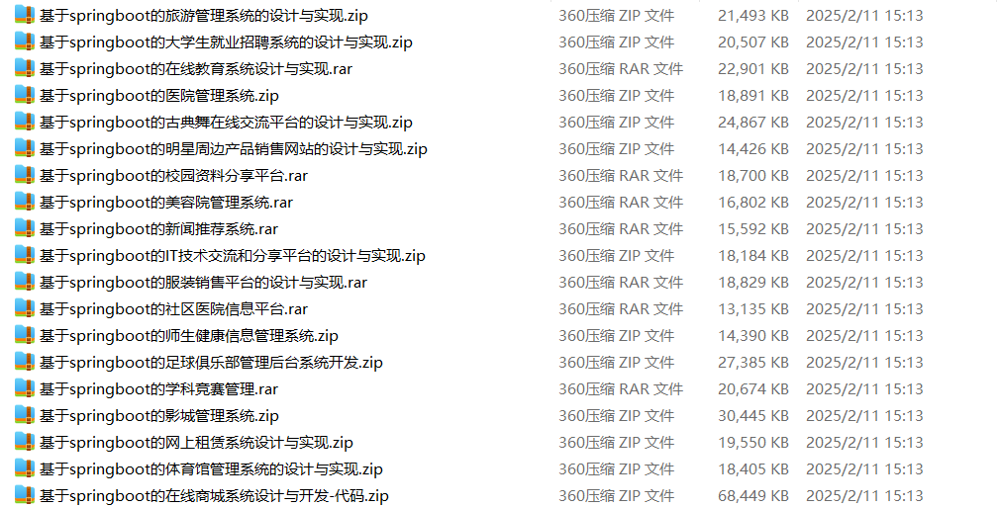

# springboot_hanfu_competition_travel

📦 SpringBoot多功能项目仓库 🎯

本仓库汇集了三个基于 **Spring Boot** 开发的高实用性项目，涵盖 **汉服租赁、竞赛管理、旅游服务** 等多个领域，适用于学习、开发实践和功能拓展！🚀

👘 **高校汉服租赁网站** —— 提供**汉服商品管理、租赁预约、在线支付、租赁订单管理、押金管理、用户评价**等功能，优化**高校汉服租赁流程** 📖🎎

🏆 **高校竞赛管理系统** —— 支持**竞赛发布、报名审核、赛事进度跟踪、竞赛评分、成绩公示、竞赛数据统计**等功能，提升**高校竞赛管理智能化** 📊✅

🌍 **旅游服务平台** —— 实现**旅游线路推荐、酒店预订、门票购买、行程规划、用户评价、旅游攻略分享**等功能，打造便捷的**在线旅游服务平台** ✈️📍

**项目部署说明**✨：

推荐使用：**谷歌浏览器**

**后台地址**😎

http://localhost:8080/springboot/admin/dist/index.html

**前台地址**😎

http://localhost:8080/springboot547vl/front/index.html

在**src\main\resources\application.yml中**编辑数据库配置🎉										
url:jdbc:mysql://127.0.0.1:3306/springbootuseUnicode=true&characterEncoding=utf8&useJDBCCompliantTimezoneShift=true&useLegacyDatetimeCode=false&serverTimezone=UTC
username: root
password: 123456

**文档预览**👀

**其他项目合集**✨

